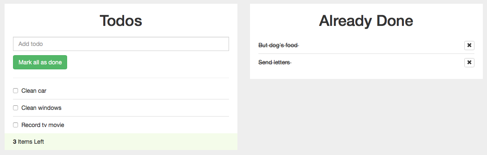

## Full Stack Web Development Bootcamp @Otoño2017

### TO-DO app ~ realizado en React, y un poco de ayuda de Bootstrap.

Transformación a React de una [template][todo-template] que usa JQuery y Bootstrap.

[todo-template]: https://bootsnipp.com/snippets/featured/todo-example